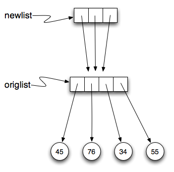

References to Sequences
=======================

In the next section, we will explore Python's implementation of lists.  In the
process the idea of an alias is defined and illustrated, which will help explain
some of the more confusing behaviors related to mutable objects such as lists.

Objects and References
----------------------

If we execute these assignment statements,

.. sourcecode:: python
    
    a = "banana"
    b = "banana"

we know that ``a`` and ``b`` will refer to a string with the letters
``"banana"``. But we don't know yet whether they point to the *same* string.

There are two possible ways the Python interpreter could arrange its internal
states:

.. image:: Figures/refdiag1.png
   :alt: List illustration 

or

.. image:: Figures/refdiag2.png
   :alt: List illustration

In one case, ``a`` and ``b`` refer to two different string objects that have the
same value. In the second case, they refer to the same object. Remember that an
object is something a variable can refer to.

We already know that objects can be identified using their unique identifier.
We can also test whether two names refer to the same object using the *is*
operator.  The *is* operator will return true if the two references are to the
same object.  In other words, the references are the same.  Try our example from
above.

.. ipython:: python

    a = "banana"
    b = "banana"

    a is b

The answer is ``True``.  This tells us that both ``a`` and ``b`` refer to the
same object, and that it is the second of the two reference diagrams that
describes the relationship.  Since strings are *immutable*, Python optimizes
resources by making two names that refer to the same string value refer to the
same object.

This is not the case with lists.  Consider the following example.  Here, ``a``
and ``b`` refer to two different lists, each of which happens to have the same
element values.

.. ipython:: python
    
    a = [81, 82, 83]
    b = [81, 82, 83]
    a is b
    a == b  

The reference diagram for this example looks like this:

.. image:: Figures/refdiag3.png
   :alt: Reference diagram for equal different lists 

``a`` and ``b`` have the same value but do not refer to the same object.

There is one other important thing to notice about this reference diagram.  The
variable ``a`` is a reference to a **collection of references**.  Those
references actually refer to the integer values in the list.  In other words, a
list is a collection of references to objects.  Interestingly, even though ``a``
and ``b`` are two different lists (two different collections of references), the
integer object ``81`` is shared by both.  Like strings, integers are also
immutable so Python optimizes and lets everyone share the same object.

Here is the example in codelens.  Pay particular attention to the `id` values.

.. codelens:: chp09_istrace
    :showoutput:
    
    a = [81, 82, 83]
    b = [81, 82, 83]

    print(a is b)
    print(a == b)

Aliasing
--------

Since variables refer to objects, if we assign one variable to another, both
variables refer to the same object:

.. ipython:: python
    
    a = [81, 82, 83]
    b = a
    a is b
    
In this case, the reference diagram looks like this:

.. image:: Figures/refdiag4.png
   :alt: State snapshot for multiple references (aliases) to a list 

Because the same list has two different names, ``a`` and ``b``, we say that it
is **aliased**. Changes made with one alias affect the other.  In the codelens
example below, you can see that ``a`` and ``b`` refer to the same list after
executing the assignment statement ``b = a``.

.. codelens:: chp09_is3
    :showoutput:
    
    a = [81, 82, 83]
    b = [81, 82, 83]

    print(a == b)
    print(a is b)

    b = a
    print(a == b)
    print(a is b)

    b[0] = 5
    print(a)
    

Although this behavior can be useful, it is sometimes unexpected or undesirable.
In general, it is safer to avoid aliasing when you are working with mutable
objects. Of course, for immutable objects, there's no problem.  That's why
Python is free to alias strings and integers when it sees an opportunity to
economize.

**Check your understanding**

.. mchoice:: test_question9_10_1
   :answer_a: [4, 2, 8, 6, 5]
   :answer_b: [4, 2, 8, 999, 5]
   :correct: b
   :feedback_a: blist is not a copy of alist, it is a reference to the list alist refers to.
   :feedback_b: Yes, since alist and blist both reference the same list, changes to one also change the other.
   
   What is printed by the following statements?
   
   .. code-block:: python

     alist = [4, 2, 8, 6, 5]
     blist = alist
     blist[3] = 999
     print(alist)

Cloning Lists
-------------

If we want to modify a list and also keep a copy of the original, we need to be
able to make a copy of the list itself, not just the reference. This process is
sometimes called **cloning**, to avoid the ambiguity of the word copy.

The easiest way to clone a list is to use the slice operator.

Taking any slice of ``a`` creates a new list. In this case the slice happens to
consist of the whole list.

.. codelens:: chp09_is4
    :showoutput:
    
    a = [81, 82, 83]

    b = a[:]       # make a clone using slice
    print(a == b)
    print(a is b)

    b[0] = 5

    print(a)
    print(b)

Now we are free to make changes to ``b`` without worrying about ``a``.  Again,
we can clearly see in codelens that ``a`` and ``b`` are entirely different list
objects.

Repetition and References
-------------------------

We have already seen the repetition operator working on strings as well as
lists.  For example, 

.. ipython:: python

    origlist = [45, 76, 34, 55]
    origlist * 3

With a list, the repetition operator creates copies of the references.  Although
this may seem simple enough, when we allow a list to refer to another list, a
subtle problem can arise.

Consider the following extension on the previous example.

.. ipython:: python

    origlist = [45, 76, 34, 55]
    origlist * 3

    newlist = [origlist] * 3

    newlist

``newlist`` is a list of three references to ``origlist`` that were created by
the repetition operator.  The reference diagram is shown below.

Now, what happens if we modify a value in ``origlist``.

.. ipython:: python

    origlist = [45, 76, 34, 55]

    newlist = [origlist] * 3

    newlist

    origlist[1] = 99

    newlist

``newlist`` shows the change in three places.  This can easily be seen by noting
that in the reference diagram, there is only one ``origlist``, so any changes to
it appear in all three references from ``newlist``.

.. image:: Figures/refrep2.png
   :alt: Same reference

Here is the same example in codelens.  Step through the code paying particular
attention to the result of executing the assignment statement ``origlist[1] =
99``.

.. codelens:: reprefstep
    :showoutput:

    origlist = [45, 76, 34, 55]

    newlist = [origlist] * 3

    print(newlist)

    origlist[1] = 99

    print(newlist)

**Check your understanding**

.. mchoice:: test_question9_12_1
   :answer_a: [4, 2, 8, 999, 5, 4, 2, 8, 6, 5]
   :answer_b: [4, 2, 8, 999, 5]
   :answer_c: [4, 2, 8, 6, 5]
   :correct: c
   :feedback_a: print(alist) not print(blist)
   :feedback_b: blist is changed, not alist.
   :feedback_c: Yes, alist was unchanged by the assignment statement. blist was a copy of the references in alist.
   
   What is printed by the following statements?
   
   .. code-block:: python

     alist = [4, 2, 8, 6, 5]
     blist = alist * 2
     blist[3] = 999
     print(alist)

.. mchoice:: test_question9_12_2
   :answer_a: [4, 2, 8, 999, 5, 4, 2, 8, 999, 5]
   :answer_b: [[4, 2, 8, 999, 5], [4, 2, 8, 999, 5]]
   :answer_c: [4, 2, 8, 6, 5]
   :answer_d: [[4, 2, 8, 999, 5], [4, 2, 8, 6, 5]]
   :correct: b
   :feedback_a: [alist] * 2 creates a list containing alist repeated 2 times
   :feedback_b: Yes, blist contains two references, both to alist.
   :feedback_c: print(blist)
   :feedback_d: blist contains two references, both to alist so changes to alist appear both times.
   
   What is printed by the following statements?
   
   .. code-block:: python

     alist = [4, 2, 8, 6, 5]
     blist = [alist] * 2
     alist[3] = 999
     print(blist)

.. note::

    This workspace is provided for your convenience.  You can use this
    activecode window to try out anything you like.

    .. activecode:: scratch_08_01
