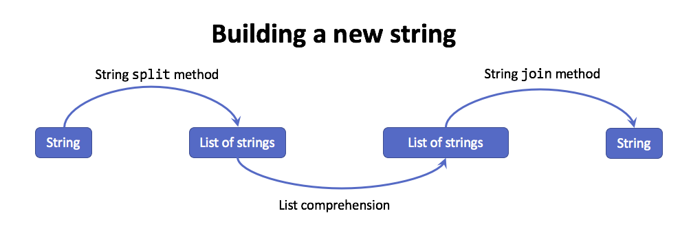

..  Copyright (C)  Todd Iverson.  Permission is granted to copy, distribute and/or modify this document under the terms of the GNU Free Documentation License, Version 1.3 or any later version published by the Free Software Foundation; with Invariant Sections being Forward, Prefaces, and Contributor List, no Front-Cover Texts, and no Back-Cover Texts.  A copy of the license is included in the section entitled "GNU Free Documentation License".

Common Comprehension Patterns
=============================

List comprehensions can replace ``for`` loops in  many (most) situations.  In
the following sections, we will highlight some useful techniques for describing
a new list using comprehensions.  

Combine information in tuples
-----------------------------

We start with useful pattern for list comprehensions involves combining
information into a tuple.  For example, lets compute the cube-root of all the
numbers between 1 and 10 and use a tuple to store both the original number and
the value of the cube-root.

.. ipython:: python

     cube_root = lambda n: n**(1/3)
     L = [(val, cube_root(val)) for val in range(1,10)]
     L

When applying a list comprehension to a list of tuples, we can save each of the
values to a separate variable by providing a comma-separated sequence of
variables between ``for`` and ``in``, as illustrated below.

.. ipython:: python

    cube_root_less_than_2 = [val for val, cube_root in L if cube_root < 2]
    cube_root_less_than_2

This approach will work for any list of tuples regardless of the length of the
tuples, provided that the number of variables matches the length of the tuples.

Use built-in helper functions
-----------------------------

The functions ``enumerate`` and ``zip`` both exhibit the pattern from the last
section.  The ``enumerate`` function can be used to
return both the index and value of each element of a sequence.

.. ipython:: python

     L = [1,2,3,4,5,6]
     pairs = [(ind, val) for ind, val in enumerate(L)]
     pairs

This can be useful if we are describing a transformation that involves both the
value and the position of the value in the sequence.  For example, suppose we
want to add 3 to the first 3 values of ``L``.

.. ipython:: python

     new_list = [val + 3 if ind < 3 else val for ind, val in enumerate(L)]
     new_list

Without ``enumerate``, we would have had to focus on the index and used the
indexing operator to access the value.

.. ipython:: python

     new_list = [L[ind] + 3 if ind <= 3 else L[ind] for ind in range(len(L))]
     new_list

Clearly using ``enumerate`` led to a simpler and easier to read construction.
Be sure to use this function whenever you need both the index and value of a
sequence.

The ``zip`` function combines two sequences into one sequence
of pairs.

.. ipython:: python

     L = [1, 2, 3, 4]
     M = ["a", "b", "c"]

     new_list = [(Lval, Mval) for Lval, Mval in zip(L,M)]
     new_list

Notice that the length of the new list is the same as the shorter list.  One
example of an application of ``zip`` comes from probability.  Suppose that
:math:`X` and :math:`Y` are random variables that are the results of rolling
fair 6 an 20 sided die, respectively.  We wish to simulate the distribution of
the sum of these two values.  We can accomplish this by generating a number of
trials for each the dice separately, then computing the sum using a list
comprehension and ``zip``.

.. ipython:: python

     from random import randint

     N_trials = 10
     six_sided = [randint(1,6) for i in range(N_trials)] 
     six_sided
     twenty_sided = [randint(1,20) for i in range(N_trials)] 
     twenty_sided

     sums = [r6 + r20 for r6, r20 in zip(six_sided, twenty_sided)]
     sums

To generalize this process, we use ``lambda`` expressions to create general
functions for creating each sequence such that the value of the number of trials
``N`` can be adjusted. 

.. ipython:: python

     six_sided = lambda N: [randint(1,6) for i in range(N)] 
     twenty_sided = lambda N: [randint(1,20) for i in range(N)] 
     sums = lambda N: [r6 + r20 for r6, r20 in zip(six_sided(N), twenty_sided(N))]
     mean = lambda L: sum(L)/len(L)
     mean(sums(1000000))

Above we illustrate this refactoring of the original code and use the newly
constructed functions to simulate the average of 1 million rolls.  As both
``six_sided`` and ``twenty_sided`` are now functions, the value of ``N`` need to
be passed along in the definition of ``sums``.  

This is another example of how lambda expressions can be used to transform a
specific example into a more general solution.  This is done by identifying the
variable(s) we would like to change and adding them as formal parameters to a
lambda expression.  This is as simple as appending the ``lambda N:`` to the
front of our expressions and changing some variable references to function
calls.

Finally, we highlight the ``reversed`` function, which allows us to
iterate through a sequence from back to front.

.. ipython:: python

     L = [1,2,3,4,5,6]
     new_list = [i for i in reversed(L)]
     new_list

Use built-in functions to reduce a list to a value
--------------------------------------------------

There are a number of built-in Python functions that help us reduce a list to a
value, including ``sum``, ``len``, ``max``, and ``min``.  Remember to use these
functions along with a list comprehension to describe a computation on a
sequence of values.

For example, suppose that we want to compute `the sum of squares
<https://en.wikipedia.org/wiki/Squared_deviations_from_the_mean>`_ for a small
set of numbers.  Let's give this a try using the regular definition, shown
below.

.. math:: 

    SS = \sum_{i=1}^n (y_i - \bar{y})^2

For each value in the list we must subtract the mean and the square this
difference.  Finally, we add up all of these values.  We will create a function
for computing the mean and then another for computing the sum of squares.

.. ipython:: python

    mean = lambda L: sum(L)/len(L)
    ss = lambda L: sum([(i - mean(L))**2 for i in L])
    my_list = [1,2,3,4,5]
    mean(my_list)
    ss(my_list)

On a modern computer, the above code is reasonably fast for fairly small lists.
Next, we use the IPython ``%timeit`` magic to time our function on various size
lists.

.. sourcecode:: python

    In [31]: %timeit ss(range(10**2))
       ....: %timeit ss(range(10**3))
       ....: %timeit ss(range(10**4))
       ....: 
    1000 loops, best of 3: 666 us per loop
    10 loops, best of 3: 53.2 ms per loop
    1 loop, best of 3: 5.97 s per loop

Notice that the ``ss`` function is costs about 100 times more (in processing
time) each we multiple the length of the list by 10.  This hints at a complexity
of :math:`O(n^2)`.  Consider the complexity of these functions.  The ``mean``
function must visit each element of the list and is :math:`O(n)`.  The
inefficiency of the ``ss`` function results from calling the ``mean`` function
**for each value in the list!**.  Thus the time complexity of ``ss`` is
:math:`n*O(n) = O(n*n) = O(n^2)`.  We can fix this issue by using the usual
simplification shown below.

.. math:: 

    SS = \sum_{i=1}^n{y_i^2} - \frac{\left(\sum_{i=1}^n y_i\right)^2}{n}

.. ipython:: python

    ss = lambda L: sum([i**2 for i in L]) - sum(L)**2/len(L)
    my_list = [1,2,3,4,5]
    ss(my_list)

Now we refactor the code to clear up the meaning of each part.

.. ipython:: python

    sum_square_values = lambda L: sum([i**2 for i in L])
    ss = lambda L: sum_square_values(L) - (sum(L))**2/len(L)
    my_list = [1,2,3,4,5]
    ss(my_list)

Each of the component functions, ``len``, ``sum_values`` and
``sum_square_values``, is :math:`O(n)` (they each visit a list element exactly
once and perform a :math:`O(1)` computation).  Therefore, this implementation is
:math:`O(n)`, which is illustrated below by the 10 fold increase in computation
time when increasing the length of a list by a factor of 10.

.. sourcecode:: python

    In [31]: %timeit ss(range(10**2))
       ....: %timeit ss(range(10**3))
       ....: %timeit ss(range(10**4))
    
    10000 loops, best of 3: 42.5 us per loop
    1000 loops, best of 3: 406 us per loop
    100 loops, best of 3: 4.11 ms per loop

.. admonition:: Beware of Premature Optimization!

    A well-known computer scientist, `Donald Knuth
    <https://en.wikipedia.org/wiki/Donald_Knuth>`_, `once said
    <http://web.archive.org/web/20130731202547/http://pplab.snu.ac.kr/courses/adv_pl05/papers/p261-knuth.pdf>`_

        Programmers waste enormous amounts of time thinking about, or worrying
        about, the speed of noncritical parts of their programs, and these
        attempts at efficiency actually have a strong negative impact when
        debugging and maintenance are considered. We should forget about small
        efficiencies, say about 97% of the time: **premature optimization is the
        root of all evil.** Yet we should not pass up our opportunities in that
        critical 3%. 
    
    It is important to think about the efficiency of your program, but follow
    Knuth's advice and worry about it only after you have demonstrated it is
    slow.  Instead, follow `another pieces of advice from Knuth
    <https://en.wikiquote.org/wiki/Donald_Knuth>`_.

        Let us change our traditional attitude to the construction of programs:
        Instead of imagining that our main task is to instruct a computer what
        to do, **let us concentrate rather on explaining to human beings what we
        want a computer to do.** 

    That is, you should focus on describing what your program does in such a way
    that another programmer can understand just by reading your code.

Use ``any`` and ``all`` for Boolean questions about a list
----------------------------------------------------------

There are two more functions that help use reduce a list to a value.  The Python
built-in functions ``any`` and ``all`` are useful when asking Boolean questions
about a list.  The function ``any`` takes a sequence as input and returns True
if *any* of the elements in the sequence evaluate to ``True``.  On the other
hand, when ``all`` is applied to a sequence, it only evaluates to ``True`` if
*all* of the elements of said sequence evaluate to ``True``.

Suppose that we want to know if any or all of the elements of a list are even.
We can write a lambda functions to perform each task as follows.

.. ipython:: python

    all_even = lambda L: all([ i % 2 == 0 for i in L])
    any_even = lambda L: any([ i % 2 == 0 for i in L])
    my_list = [1,2,3,4,5]
    any_even(my_list)
    all_even(my_list)

Notice that this pattern involves

1. Using a Boolean expression in the output expression of the comprehension.
2. Applying ``any`` or ``all`` to the list of Boolean values.

Let's refactor this code to clean it up, namely by introducing an ``is_even``
function.

.. ipython:: python

    is_even = lambda n: n % 2 == 0
    all_even = lambda L: all([is_even(i) for i in L])
    any_even = lambda L: any([is_even(i) for i in L])
    my_list = [1,2,3,4,5]
    any_even(my_list)
    all_even(my_list)

Use a comprehension to apply many functions to a value
------------------------------------------------------

Suppose that we want to apply many functions to the same value.  We can
accomplish this using a list of functions and a list comprehension.  In the
first example, we will compute a number of statistics on the same list.

.. ipython:: python

     mean = lambda L: sum(L)/len(L)
     funcs = [mean, max, min]
     L = [1,2,3,4,5]
     stats = [stat_func(L) for stat_func in funcs]
     stats

In the previous example, each function is pulled out of the ``funcs`` list and
applied to the list in sequence. We can use a similar approach, combined with
the ``any`` function, to check if a given value is a number of some sort, be it
int, real or complex.

.. ipython:: python

    is_type_funcs = [lambda n: type(n) is int,
                     lambda n: type(n) is float,
                     lambda n: type(n) is complex]

    is_number = lambda n: any([is_type_func(n) for is_type_func in is_type_funcs])
    is_number(5)
    is_number(2.3)
    is_number("a")

One thing to note about the last example is that we used to anonymous nature of a
lambda expression to define each of the functions for checking a type *inside
the list definition* without assigning each to a separate name.

Filter and count using ``len``
------------------------------

You can use the ``if`` clause along with the length function to count the number
of elements that satisfy a condition.  In a previous example, we simulated the
distribution of the sum of rolls on a six and twenty sided die. Suppose that we
wish to estimate the frequency of the result of the sum being prime.   First, we
will use filtering and ``len`` to answer the question.

.. ipython:: python

     six_sided = lambda N: [randint(1,6) for i in range(N)] 
     twenty_sided = lambda N: [randint(1,20) for i in range(N)] 
     sum_rolls = lambda N: [r6 + r20 for r6, r20 in zip(six_sided(N), twenty_sided(N))]
     primes = [2, 3, 5, 7, 11, 13, 17, 19, 23]

     num_primes = len([i for i in sum_rolls(10000) if i in primes])
     prop_primes = num_primes/10000
     prop_primes

We get the number of primes in the simulation by filtering with ``if i in
prime`` and then using ``len`` to count the number of results.

Another approach to the last example is to map results to 0 or 1 based on the
condition, then using sum to answer the question.       

.. ipython:: python

     primes_rolls = [1 if i in primes else 0 for i in sum_rolls(10000)]
     prop_primes = sum(primes_rolls)/10000
     prop_primes

We can compare the efficiency of these methods using the IPython ``%timeit``
magic after abstracting each approach with a lambda expression.

.. ipython:: python

     with_zero_one = lambda N: sum([1 if i in primes else 0 for i in sum_rolls(N)])/N
     %timeit with_zero_one(10000)

.. ipython:: python

     with_len= lambda N: len([i for i in sum_rolls(N) if i in primes])/N
     %timeit with_len(10000)

It is not surprising that these methods have nearly the same efficiency, as they
both have to visit each entry once and must count values.

.. admonition:: Question

     Can you prove that each of these approaches is :math:`O(n)`?

Use ``for`` twice to get all combinations
---------------------------------------

Suppose that we have two list ``L`` and ``M`` and we want to perform some
computation on all combinations of elements from these two lists.  This can be
accomplished using two (independent) ``for`` twice, once for each list.  The code
shown below creates a tuple of all combinations.

.. ipython:: python

    L = [1,2,3]
    M = ["a", "b"]

    new_list = [(i,j) for i in L for j in M]
    new_list

The second ``for`` can depend on the first
------------------------------------------

The last example illustrated a comprehension pattern for constructing all
combinations of elements from two list.  Consider the following program, which
applies this technique to one list versus itself.

.. ipython:: python

    L = [1,2,3]

    new_list = [(i,j) for i in L for j in L]
    new_list

Notice that some combinations are repeated, e.g. ``(1,2)`` and ``(2,1)``.
Suppose that instead we want all unique pairs of values.  In math, this
collection is often described as all :math:`i,j` such that :math:`i \le j`.  We
can use this approach with comprehensions as well.  Two methods are shown below.

**Method 1 - Filter with ``if``**

.. ipython:: python

    L = [1,2,3]

    new_list = [(i,j) for i in L for j in L if i <= j]
    new_list

The first approach matches the mathematical definition exactly and ensures that
no value is matched with another value more than once by keeping the pairs
sorted.  One of the reasons that comprehensions are useful is they mirror the
mathematical language of describing a collection.  The only drawback to this
approach is that it requires cycling through all combinations.  Because that are
:math:`n` values to pair with each of :math:`n` values, this operation is
:math:`O(n*n)=O(n^2)`.  Suppose that we know that there are no repeated values
in ``L``.  In this case, we can filter by *indices* instead of *values*.  The
resulting method, while still :math:`O(n^2)`, will be close to twice as fast.

**Method 2 - Use indices and ``range`` to filter**

.. ipython:: python

    L = [1,2,3]
    n = len(L)
    new_list = [(L[i],L[j]) for i in range(n) for j in range(i,n)]
    new_list

This approach ensures that no index is matched with another index more than
once.  The key point here is that we made the second ``range`` depend on the
first, shortening the length of the sequence.  Provided that all the elements of
``L`` are unique, this second method iterates over :math:`\frac{n(n-1)}{2}`
elements instead of :math:`n^2`.  In the long run, this approach will be a
little less than twice as fast but approach exactly twice as fast
asymptotically.  Unfortunately, :math:`O\left(\frac{n(n-1)}{2}\right)=O\left(\frac{n^2}{2} -
\frac{n}{2}\right)=O(n^2)`, so this will still be expensive for large list.

Flatten a 2D data structure
---------------------------

A 2D data structure can be flattened using two ``for`` expressions.  The second
``for`` will iterate over the *rows* from the first ``for``.  To flatten the
data structure, don't include an inner comprehension.

.. ipython:: python

    list_of_lists = [[1], [1, 2], [4, 5, "a"]]
    flat_list = [item for row in list_of_lists for item in row]
    flat_list

This pattern can take some time to get used to, but we note that it matches the
imperative approach to the sample problem.

.. ipython:: python

    flat_list = []
    for row in list_of_lists:
        for item in row:
            flat_list.append(item)
    flat_list

The following figure illustrates this connection.

    ..

    The list comprehension for looping through all rows and items preserves the
    order shown in the double for loop from the imperative approach.

In general, readers familiar with writing imperative loops can use those
patterns to transition to comprehensions.
    
Sometimes it is easier to describe what your don't want
-------------------------------------------------------

Suppose that we want to use list comprehensions to describe all the prime
numbers up to ``n=120``.  A well-known algorithm for describing primes is the
`Sieve of Eratosthenes <https://en.wikipedia.org/wiki/Sieve_of_Eratosthenes>`_,
For each number ``i`` between 2 and :math:`\sqrt{n}`, this algorithm crosses out
all the multiples of ``i``.  The remaining numbers will be prime.  Notice that
this algorithm describes numbers that are prime by *decribing all numbers that
are not*.  The following two list comprehensions perform the task of finding all
primes up to 120.

.. ipython:: python

    from math import sqrt
    n = 120
    not_prime = [j for i in range(2, int(sqrt(n) + 1)) for j in range(2*i,n + 1, i)]
    prime = [i for i in range(2,n+1) if i not in not_prime]
    prime

**Illustration of the Sieve of Eratosthenes**

.. figure:: https://upload.wikimedia.org/wikipedia/commons/b/b9/Sieve_of_Eratosthenes_animation.gif
    :alt: Illustration of the Sieve of Eratosthenes
    
    ..

    The Sieve of Eratosthenes finds all the primes up to some number ``n`` by
    crossing out all multiples of numbers from 2 to :math:`\sqrt{n}`.  This image was
    copied from `Wikipedia
    <https://commons.wikimedia.org/wiki/File:Sieve_of_Eratosthenes_animation.gif>`_
    and is covered by the `GNU Free Documentation License
    <https://en.wikipedia.org/wiki/en:GNU_Free_Documentation_License>`_.

As always, we can clean this code up with a little refactoring.  Let's use two
lambda expressions to give meaning two applications of range in ``not_prime``.

.. ipython:: python

    from math import sqrt
    n = 120
    possible_factors = lambda n: range(2, int(sqrt(n) + 1)) 
    multiples_of = lambda i, n: range(2*i,n + 1, i)
    not_prime = [j for i in possible_factors(n) for j in multiples_of(i, n)]
    prime = [i for i in range(2,n+1) if i not in not_prime]
    prime

.. admonition:: question

    How might you make the last example more general?

Joining Tables
--------------

If our lists represent 2D tables of data, we can use comprehensions to join two
tables, a common operation in SQL.  

.. note:: 

     If you don't recall the distinctions between the different types of joins,
     see the first answer to `this stack overflow question
     <http://stackoverflow.com/questions/38549/what-is-the-difference-between-inner-join-and-outer-join>`_.

Recall that an *inner-join* combines all rows such that the rows match in some
way.  For example, if we have two lists that contain our employees hours and job
title, respectively.  The following program computes the inner join of these two
tables when matching the employees name.  Any rows for employees that don't
appear in both tables will be dropped.

.. ipython:: python

    hours = [["Alice", 43],
               ["Bob", 37],
               ["Fred", 15]]
    titles = [["Alice", "Manager"],
              ["Betty", "Consultant"],
              ["Bob", "Assistant"]]

    inner_join = [ (nameH, ttl, hrs) for nameH, hrs in hours for nameT, ttl in titles if nameH == nameT]
    inner_join

The left outer join of the tables will include all of the rows from the first
list, as well as the values from the second table if present.  Here is the code
for performing a left outer join using a list comprehension.  We do this by
combining the inner join with the rows that only appear in the left table.

.. ipython:: python

    hours = [["Alice", 43],
               ["Bob", 37],
               ["Fred", 15]]

    titles = [["Alice", "Manager"],
              ["Betty", "Consultant"],
              ["Bob", "Assistant"]]

    left_names = [name for name, h in hours]
    right_names = [name for name, t in titles]

    inner_join = [ (nameH, ttl, hrs) for nameH, hrs in hours for nameT, ttl in titles if nameH == nameT]
    left_only_rows = [(name, None, hrs) for name, hrs in hours if name not in right_names]
    left_join = inner_join + left_only_rows
    left_join

You may have noticed that this approach required us to iterate through each
table a number of times.  This is not the most efficient implementation, and a
solution that uses a relational database should be used to larger problems, but
for small problem this approach should be fine.

Apply Tranformations at Each Level of Abstraction
-------------------------------------------------

.. todo:: Include the examples found in ~/Desktop/grayscale.py

More on working with strings and lists
--------------------------------------

There are two common patterns that are applied when processing strings.  Both
patterns start by using the string ``split`` method to split the string into a
list of strings.  Then a list comprehension is used to transform the list of
strings and some post-processing is applied.

The first pattern is used when computing statistics about a string.  The
following figure illustrates this process.

.. figure:: Figures/string_statistic_diagram.png
    :alt: The process of computing statistics about a string

    ..

    The process for computing a statistic about a string envolves splitting
    the string into a list of strings, tranforming the string into another
    list and then reducing that list to a value.

Let's start by counting the number of vowels in a word.

.. ipython:: python

    vowels = "aeiou"
    word = "Mississippi"
    num_vowels = len([ch for ch in word if ch.lower() in vowels])
    num_vowels

We generalized this expression with lambda expression.
    
.. ipython:: python

    num_vowels = lambda word: len([ch for ch in word if ch.lower() in vowels])
    num_vowels("Minnesota")

Next, we will use this function to compute the average number of words in a
sentence.  We start by going through the process step-by-step.

.. ipython:: python

    from string import punctuation
    quote = '''I know something ain't right.
        Sweetie, we're crooks. If everything were right, we'd be in jail.'''
    s_no_punc = "".join([ch.lower() for ch in quote if ch not in punctuation])
    s_no_punc
    
    words = quote.split()
    words

    nums = [num_vowels(word) for word in words]
    nums
    # Using the mean function defined in earlier examples
    average_num_vowels = mean(nums)
    average_num_vowels

Finally, we generalize this process with a little refactoring.

.. ipython:: python

    remove_punc = lambda s: "".join([ch.lower() for ch in s if ch not in punctuation])
    clean_and_split = lambda s: remove_punc(s).split()
    average_num_vowels = lambda s: mean([num_vowels(word) for word in clean_and_split(s)])
    average_num_vowels("Long, long ago in a galaxy far, far away.")

A second string processing pattern that is commonly applied involves
transforming one string into another.  Again we illustrate the process with a
diagram.

    ..

    The process for computing a statistic about a string envolves splitting
    the string into a list of strings, tranforming the string into another
    list and then reducing that list to a value.
