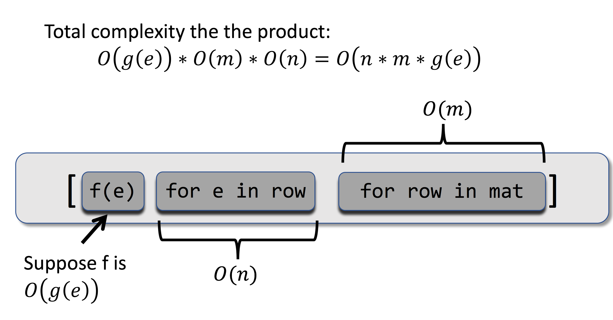
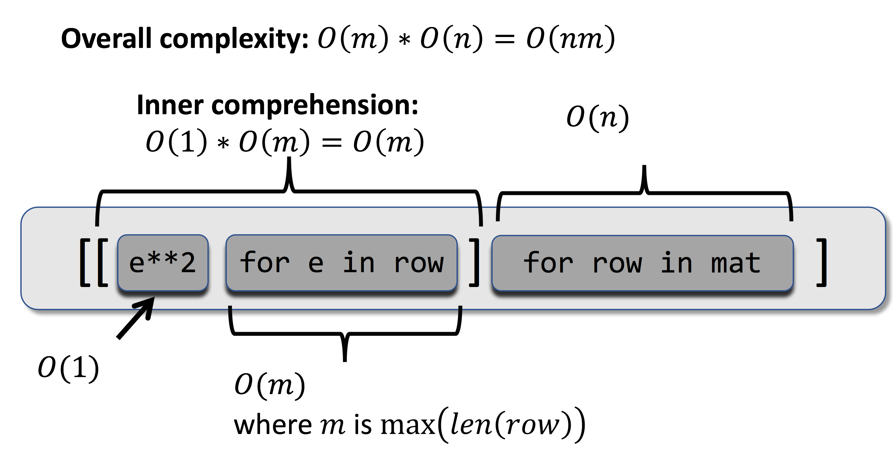

..  Copyright (C)  Todd Iverson.  Permission is granted to copy, distribute
    and/or modify this document under the terms of the GNU Free Documentation
    License, Version 1.3 or any later version published by the Free Software
    Foundation; with Invariant Sections being Forward, Prefaces, and
    Contributor List, no Front-Cover Texts, and no Back-Cover Texts.  A copy of
    the license is included in the section entitled "GNU Free Documentation
    License".

The Computational Complexity of a List Comprehension
====================================================

The structure of a list comprehension makes it easy to determine 
computational complexity.  The following figure illustrates the process of
computing the complexity of each part of a comprehension and combining the
results into the overall complexity.

    ..

    Each ``for`` in the comprehension iterates over the coorespoonding sequence
    and has complexity O(len(L)).  We combine the compexity of the
    output expression with the complexity of iterating over each sequence by
    multiplication.

For example, consider the complexity of squaring all the entries in a matrix.
The figure shown above shows how we can quickly determine that this operation
has a time complexity of :math:`O(nm)`.

    ..

    Here we determine the complexity of squaring each element of a matrix.  Note
    the output expression for the outer comprehension is itself a comprehension.

