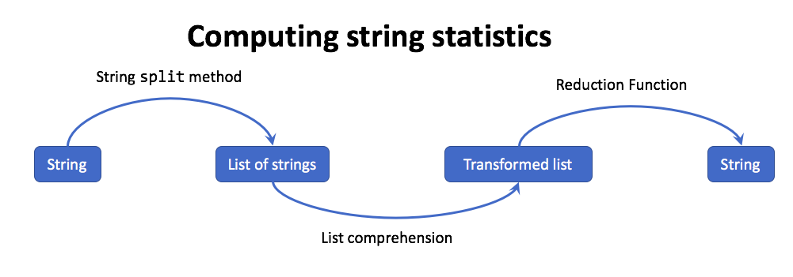

    ..  Copyright (C)  Todd Iverson.  Permission is granted to copy, distribute
    and/or modify this document under the terms of the GNU Free Documentation
    License, Version 1.3 or any later version published by the Free Software
    Foundation; with Invariant Sections being Forward, Prefaces, and
    Contributor List, no Front-Cover Texts, and no Back-Cover Texts.  A copy of
    the license is included in the section entitled "GNU Free Documentation
    License".

Working with Strings and Lists
==============================

Data wrangling envolves transforming data from some raw form to another more
useful form.  Often this raw form is text saved in a text file, which
corresponds to the Python string data structure.  In this section, we will
illustrate the process of converting and transforming textual data list
comprehensions and the ``split``, ``join`` and ``format`` methods.

More on working with strings and lists
--------------------------------------

There are two common patterns that are applied when processing strings.  Both
patterns start by using the string ``split`` method to split the string into a
list of strings.  Then a list comprehension is used to transform the list of
strings and some post-processing is applied.

The first pattern is used when computing statistics about a string.  The
following figure illustrates this process.

    ..

    The process for computing a statistic about a string envolves splitting
    the string into a list of strings, tranforming the string into another
    list and then reducing that list to a value.

Let's start by counting the number of vowels in a word.

.. ipython:: python

    vowels = "aeiou"
    word = "Mississippi"
    num_vowels = len([ch for ch in word if ch.lower() in vowels])
    num_vowels

We generalized this expression with lambda expression.
    
.. ipython:: python

    num_vowels = lambda word: len([ch for ch in word if ch.lower() in vowels])
    num_vowels("Minnesota")

Next, we will use this function to compute the average number of words in a
sentence.  We start by going through the process step-by-step.

.. ipython:: python

    from string import punctuation
    quote = '''I know something ain't right.
        Sweetie, we're crooks. If everything were right, we'd be in jail.'''
    s_no_punc = "".join([ch.lower() for ch in quote if ch not in punctuation])
    s_no_punc
    
    words = quote.split()
    words

    nums = [num_vowels(word) for word in words]
    nums
    # Using the mean function defined in earlier examples
    average_num_vowels = mean(nums)
    average_num_vowels

Finally, we generalize this process with a little refactoring.

.. ipython:: python

    remove_punc = lambda s: "".join([ch.lower() for ch in s if ch not in punctuation])
    clean_and_split = lambda s: remove_punc(s).split()
    average_num_vowels = lambda s: mean([num_vowels(word) for word in clean_and_split(s)])
    average_num_vowels("Long, long ago in a galaxy far, far away.")

A second string processing pattern that is commonly applied involves
transforming one string into another.  Again we illustrate the process with a
diagram.

.. figure:: Figures/building_a_string_diagram.png
    :alt: The process of computing statistics about a string

    ..

    The process for computing a statistic about a string envolves splitting
    the string into a list of strings, tranforming the string into another
    list and then reducing that list to a value.

.. include:: CharacterClassification.rst
